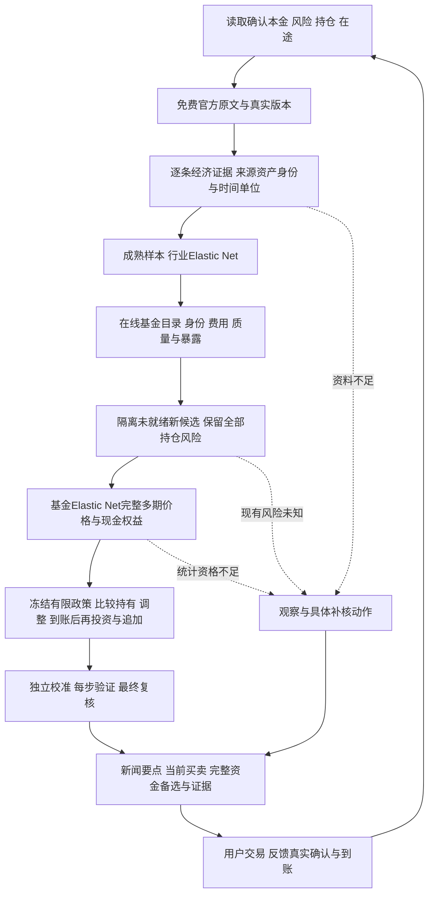

# Investment

插件版本 **0.0.1**；购买渠道 **天天基金**；研究仅用免费可核原文，插件不执行交易。

直接调用公开入口即可：入口先核验并加载锁文件中的依赖及上海时区，再采集、分析、自动验证和输出。无需额外启动包装脚本。首次报告生成时封存请求绑定的决策时间；同ID中断恢复复用该时间，运行日志另记真实时间，发布时仍重新检查时效，验证预算不重置。

准确性、证据和可验证性优先于新闻数量、基金数量与来源覆盖。缺覆盖保留未知及具体补核任务，不能写成零值、无新闻或不可买事实。来源事实、量纲时点、数值计算与样本外预测证据分别核验；预测准确率须由真实评价取得，工程测试数量不证明市场盈利。详见[科学契约](skills/investment/references/scientific-contracts.md)。

## 日常主线

每天取得最新新闻与仍有效的背景，核验经济内容，预测行业和基金，再把真实持仓、本金、费用、在途和风险纳入滚动资金比较。交易由扣费净优势或有证据的风险降低支持；一年期限、评价窗口和持有年龄均不自动触发卖出。现金余额可保留，不推荐余额宝或货币基金等纯活期收益产品。



## 每一步的算法与证据

| 环节 | 方法 | 实际资格 |
|---|---|---|
| 账户 | 事件账本归约、金融身份、单位净值核算 | 本金/现金来自真实确认；预算和预测不入账 |
| 新闻 | 注册官网HTML/PDF重提取、时间与版本状态机 | 正文/引文一致，不等于影响正确或全球全覆盖 |
| 经济内容 | 原文数值、单位、期间及五种客观政策动作 | source_revision排除分析续期；指标词表仅训练内学习 |
| 行业与资产 | Elastic Net、训练内标准化和前向选参 | 92项基础字段加训练内指标编码；逐条事件缺口单列，未识别新指标待核 |
| 基金发现 | 实时目录、完整同类组、原始合同准入 | 不使用内置产品白名单；资本与新候选资格分开 |
| 产品质量 | 原文准入、原点可知质量特征与Elastic Net时序选择 | 权重由训练学习；历史α不认证技能、不直接添加收益 |
| 组合数据 | 已知估值与成交日价格分离、完整多日期NAV/现金权益 | 未知当日成交价也建模；不插值、不把未知分红当零；标签与校准隔离 |
| 决策 | 来源现金/份额动作菜单与非预知现金反馈政策的完整资金路径比较 | 仅声明封存政策类内最优；预算不足不给未完成搜索的赢家；未来买入是估值假设 |
| 风险 | 本金金额预算、声明信息分区的CVaR与来源压力 | 历史诊断和模型约束不保证未来最大亏损 |
| 发布 | 独立算术/来源及可读报告语义核对、重放、租约/CAS | 每基金一笔赎回；每阶段每轮至多三次，最终至多三轮；失败不得改数据过关 |

行业收益只进入基金协变量，不再次加到基金现金或财富。基金质量指标不自动叠加到EN预测，也不采用公司/经理固定分数。指标、词表、标准化、参数及现金时间字典仅从相应成熟训练段取得。基金风格和多期标签均由完整原NAV及现金权益构建，inner fold保留自己的实际可得版本；外层后来实现值不能覆盖inner证据。

质量先做原文交易准入，再构建原点可知特征。启用/关闭质量块是同一Elastic Net框架内的预登记比较：选择期决定启用，独立校准期保持未见。当前回顾统计不回填历史；经理团队从完整原文独立定位主体并核全部相关行及续表，locators只是提示；真实覆盖声明与日期端点支持连续组件，整个NAV区间必须位于同一组件。当前快照不证明历任全集，后资料不覆盖前历史；proof仍须从原字节再重建。缺声明、未知布局、当前名单冲突、新任零观察或过期保持unknown，仅关闭Q-On，不删除现有风险或合格Q-Off。不表示所有官网含统一覆盖字段或全部发行人已适配。详见[基金选择](skills/investment/references/fund-selection.md)。

资产输入覆盖股票、债券、商品、境外、混合与FOF的来源域，区分单行业、多行业、主题、市场、利率、久期、信用、商品、汇率、套保、穿透及风格角色。每个主体必须有原文身份、分类映射、单位、变换、币种、日历和可得时间。利率用可含负数的水平变化，价格用对数变化；人民币份额的境外基金仍须保留底层市场时区与汇率方向。以常见类型的适用证据为准，不设覆盖百分比目标。

历史披露、模型估计和未知暴露分别保存。过去披露可作有日期的研究输入；Elastic Net拟合的因子系数可带负号或为零，不能归一化成真实持仓比例。没有原文证明的当前暴露保持未知，全部已持风险继续计入。39项基金桥接字段分别保留每个角色的预测与可用标识，以及未映射、陈旧披露和估计标识，不能把缺资料当预测为零。

## 新闻范围

国家发改委接入新闻发布、政策公开及解读；国务院、统计局、央行、证监会、美联储、欧洲央行和国家医保局按登记的真实正文适配取得资料。医保局覆盖其政策发布，不代表药监审批或所有企业公告。PDF保留父公告与真实发布时间。原文发布、首次取得、政策生效和分析复核时间分别保存，只有源版本变化才构成新源信息。

默认采集持久保存来源游标及列表、正文、修订任务，轮转处理；重复列表不抢占待采正文。正文URL在请求前确定，失败也计入该明确集合；未处理链接另记待采，不能借有限正文核验声称整站或全天完整。PDF依赖父公告时，在同一操作取得真实父公告与附件；预算不足保留依赖。

来源按主题声明最小核查集合，记录有限文章、遗漏、预算和错误。不把列表访问当正文，不把HTTP200当时效/语义有效。正文规则、发布入口或来源不足时继续报告可核部分，不补造市场新闻、权重或可得日期。

publish_cutoff为封存的检索发布边界；每次采集完成时由控制器封存真实information_cutoff_at。精确时刻与仅日期的文章均须在该信息封存前实际取得；日期精度不补造午夜发布时间。报告保留文章与检索边界的before/after/overlaps关系。历史回放沿用原信息封存与原run注册表，后取得的资料不得回填过去。

analysis_start封存news_policy、注册快照与摘要；默认采集读取该范围，显式来源必须为其子集。采集、评估、自动验证及调度队列均绑定该策略；换策略创建新请求，原文身份与首次取得时刻不被改写。

每个仍有效事件逐个主体核验为数值证据、客观政策编码、未支持或来源缺口。此前GDP数据不能代替今天尚未编码的新政策；解释性文字不能直接当成上涨概率。原文捕获绑定当时来源注册快照，后来扩展注册表不能改写旧原文的身份、首次取得时间或报价时效。

## 初次与新增机会

首次缺少真实本金、亏损容忍率或账户状态先询问；已有确认继续沿用。空研究库先尝试采集与构建，只有足够成熟且有真实PIT证据的历史才能训练。今天取得的旧资料不能改写成过去已知；反复执行不增加真实独立样本。

新增C缺资料进入观察，不让C改变合格A/B样本及定价日。多基金相关误差必须来自同原点完整面板。系统封存有限真实资格家庭、计算预算与覆盖，不按基金代码作金融排序。现有持仓始终计入账本及风险；未知现有风险不能通过删持仓得到安全结论。

完整同类组的准入与采集批次分离，50支只是单批来源处理规模。超过50支的合格组仍保留完整候选集合，统一原点、风险和统计资格；不能拼接各批赢家或丢失跨基金相关性。发行人补证沿真实资料页的原文href，或已捕获公告菜单发布的JS/API与原始PDF模板发现；只接受登记域及可重建的原站链路。未经主体、原文与结构位置核验的资料、未知字段及采集失败保留具体补核任务。

基金NAV保留来源版本、实际取得时刻及可得证据，历史特征和成熟目标按当时可知版本选择；后来的修订不覆盖旧训练。没有合格历史证据时仍标明固定发布延迟的条件研究代理，不能由新增字段认证严格历史PIT或真实可执行收益。

## 金额、费用与到账

令确认净本金B、当前权益V、相对本金亏损容忍率r、假设追加d：

```text
B_d = B + d
V_d = V + d
F_d = B_d × (1-r)
A_d = V_d - F_d
max E[W_H(policy,d)-W_H(hold,d) | 当前真实信息]
约束：源交易/现金/份额/费用/风险/暴露规则与独立校准资格
```

W包含正确的登记权益、除息应收、支付、确认退款与交易费；`path_execution_cost+terminal_exit_assumption_cost=fees`，路径执行和终点退出估值各净计一次，不能再从W重复减fees。毛额舍入调整可带符号，与合同费及净额尾差分列；终点退出是假设而非当前订单。近期实际费加全计划最坏情景fees继续保守预留滚动额度。原已支付费用、NAV内运营费用不重复扣。实际正常定价/确认/到账按来源日历；异常延后没有无条件保证。未来阶段会比较赎回到账后使用现金的价值，实际发布只含当前零追加订单。以后真实确认、到账或新闻改变，使用新请求重新决策。

当前动作统一为买入现金扣款和卖出批次份额。按来源精度生成有限金额/份额菜单、费档边界及相邻格点，核验产品汇总门槛和批次分配规则，再比较全路径扣费财富。同等资金的普通可行域内以预期净利润排序；维持方案同样核验风险，仅豁免与自身比较的净优势门槛。若没有普通可行方案，合法纯减仓按登记的经验风险超额优先规则作为risk_recovery单列，eligible=false、risk_not_restored，不称风险预算通过。不同追加额分别与同额维持方案比较，不拿更大本金的绝对利润选当前方案。

零追加和各追加组独立搜索与校准；追加组超预算不会清空完整零追加组。所有资金组及政策数量上界在比较前封存，未完成组保留错误预算，不能事后缩小统计范围。正式declared策略须同时在family的[start_at,end_at)和复核次数上限内；pipeline实际执行trade-history→readiness→trade-inputs，在active正式统计结果前用稳定request_id原子预留预算。同ID重放只占一次，无赢家或中断仍占额度；历史使用记录缺失unknown，不自动reset。过期/示例继续新闻资料与持仓风险，无当前订单；family.end_at是复核/发布许可，不是基金持有到期或一年卖出规则。未来合法检查节点由来源锁定、费档及到账窗口产生；节点不是预约卖出日。条件赎回候选比较滞后可见净变现额与封存已知持仓价值及当前申购投入的零增益分界，两方向候选均由完整EN路径净财富、CVaR和独立校准评选；首次满足才在该情景模拟赎回，否则继续持有。只发布今天的动作，后续按真实新闻、确认及到账重新分析。

账面权益V使用带原始捕获证明的已知NAV；申赎份额和现金路径使用成交日NAV。今天尚未公布的NAV不能固定为昨日估值。报告另保留“已知NAV参考＋来源正常确认/到账估算”；真实价格、费用和到账来自实际回执。

费用入口按原文格式解析，不绑定某支基金。普通账户与养老金账户分别核验；产品定价、确认、到账日历按合同角色绑定。买入、全赎回、部分赎回的证据缺项分别阻断对应动作。费率区间保留端点开闭；按来源选择四舍五入、截断及基金承担尾差，分别记录合同手续费和取整损耗，真实回执费用保持原样。

已确认但未到账的既有应收款保留逐笔金额、来源身份与到达时钟，供后续现金配置估值；未来估计不修改真实账本。只有日期的到账资料按日末处理，未知到达条件明确补核。每条用于比较的现金路径都独立复核合同费用、净额、到账时序及连续余额；现金期限只增加截止日余额要求。

赎回回执可在sell_fill.data提供actual_redemption_confirmed_at，明确实际确认时点。确认日结束的持有费期使用该时点，执行日结束的费期使用实际price_date；晚收到回执不延长实际持有费期。确认终点缺失时保留原报手续费和净额，记录expected_quote_unknown并要求补核，原成交记录不被补写。

声明现金需求时，截止日每条来源情景的已到账、未占用现金必须达到所需金额；应收和终值持仓不能充当现金。截止日在收益终点之后时，仅推进有证据的已有确认、退款与到账，不改变原收益终点。现金不足或需要未覆盖价格时，基线和减险例外也不得绕过。

费用表按各产品源合同的费档及最低持有期边界自动生成计费年龄；没有年龄费档时只用来源最低持有年龄，不要求用户填写赎回日期或持有天数。H仅为内部收益和风险评价窗口，不限制基金持有期。未到账赎回、分红应收及预计追加不能支持当前买入。行业现货证券gross/NAV上界来自当前合同，可超过1；无证据界限保持unknown，不把历史披露或资本份额冒称实时行业风险。

## 输出与记录

报告依次交付新闻要点、持仓变化、资金备选和来源/计算/统计资格。新闻说明时间、事实/推断、品类、机制、反证和原文；当前订单列代码、金额/份额、费用、资金来源与证据。每个追加方案列具体基金和金额，并标未确认入金；后续换入情景不得改成当前订单。

历史在 **$HOME/.investment/**，按计划、时间及容量归档，保留原始金融事实与来源版本。同请求重放原时点结果；新一天、新信息或新确认用新ID。详见 [存储](skills/investment/references/storage.md)、[流程](skills/investment/references/workflow.md)、[执行](skills/investment/references/execution-contract.md)、[模型](skills/investment/references/allocation-method.md)、[训练](skills/investment/references/training.md)、[基金](skills/investment/references/fund-selection.md)、[报告](skills/investment/references/reporting-and-records.md)。

每日净值研究按已验证基金主体索引汇入此前封存的原始捕获，保留原取得时间并重验原文字节及来源。索引读取有数量、字节和时间边界；未完成封存的重试资料不能证明历史可得性。报告中的条件模型误差下界读取所选政策的实际金额，缺少校准时不生成金额。

## 科学依据与验收

[科学契约](skills/investment/references/scientific-contracts.md)逐环节列明定义、依据、假设、参数来源、适用范围、源码边界及独立验收。数学恒等式、统计模型、风险偏好、合同事实与计算预算分别标识，不把工程选择冒称论文结论。独立资格证书重算候选完整性、预算、资格和有限集合赢家，不仅重跑同一优化函数。

- [Elastic Net原论文](https://doi.org/10.1111/j.1467-9868.2005.00503.x)：正则化；本地特征有效性需样本外证明。
- [多期组合优化/MPC](https://web.stanford.edu/~boyd/papers/cvx_portfolio.html)：估值未来序列，只执行第一阶段。
- [CVaR原论文](https://sites.math.washington.edu/~rtr/papers/rtr179-CVaR1.pdf)：尾部平均损失的场景优化。
- [稳健优化](https://www.mit.edu/~dbertsim/papers/melvyn/The-Price-Of-Robustness-OR52.pdf)：源支持不确定边界内的约束。
- [经理运气与能力](https://onlinelibrary.wiley.com/doi/abs/10.1111/j.1540-6261.2010.01598.x)：风险调整、多重比较与估计不确定性。
- [模型选择偏差](https://www.jmlr.org/papers/v11/cawley10a.html)：特征选择、训练内选参与独立校准分别隔离。
- [数据来源追溯](https://www.w3.org/TR/prov-overview/)：追踪原实体、处理活动及责任边界；仅借用原则，不宣称完整PROV合规。
- [历史版本](https://alfred.stlouisfed.org/help)：真实版本可得日期与今天取得日期分别保留。

工程手算/边界/合成源链、真实HTTP来源验收、新闻增量的独立样本外检验和[正式前瞻评价](skills/investment/references/trial-validation.md)分别记录。理论、重放和历史数据取得都不构成未来盈利证明。常见资产域接入后，具体基金仍须取得适用的主体、费用、行情、暴露和历史资格；当前实际交易范围仍是天天基金人民币场外份额。

可选的 `daily_review.payload.paired_currency_validation` 封存同资金研究账户、来源历史、合同范围与两组预测，默认执行器比较含/不含新闻资产协变量的扣费财富、回撤、尾部损失及换手。事后用当前费率重定价必须标明为研究重放；只有终点预测时限于当前动作后持有，完整再投资比较须有多日期原文训练与预测。单点预测的CVaR只是在该退化分布下的金额损失，不冒充残差尾部风险验证；不足的真实历史保留具体补核动作。原生模型在此是隔离的研究对照，不参与生产订单选择。
