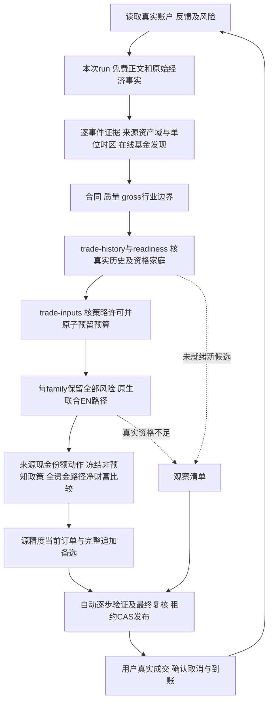

# 统一日常决策与金融记录

入口 scripts/investment.py run --root <root> --plan <plan> --request <request.json>，schema4，插件0.0.1。先读[执行契约](execution-contract.md)。

```json
{"schema_version":4,"request_id":"example-status-1","operation":"status","payload":{}}
```

| 意图 | operation |
|---|---|
| 实际账户/首次缺项/风险/计划 | status |
| 确认本金与账户、风险版本/临时窗口、事实修订后对账 | profile_initialize、risk_update、capital_reconcile |
| 确认币种/天天基金/排除品类/限额与计划版本 | plan_update |
| 外部入金/出金准备、确认和追加修订 | cashflow_prepare、cashflow_confirm、cashflow_correct |
| 实际成交、取消、权益和到账 | feedback |
| 权威本次run与新闻发布截点 | analysis_start |
| 原文采集与经济事实/研究解释 | news_collect、news_assess |
| 新闻绑定行业原始证据 | industry_prepare |
| 当次目录与原文身份/同类组 | fund_discover |
| 原文HTML/PDF及报价提取 | source_capture、fee_inspect |
| 来源数据准备、审计、市场引用 | research_prepare、research_verify、market_prepare |
| 全部适用阶段/真实family比较和规范报告 | daily_review |
| 同源引擎条件重放 | allocation_replay |
| 预登记/校准/决定/结果/评价 | trial_calibrate、trial_register、trial_decision、trial_outcome、trial_evaluate |
| 原文/引用/状态审计与容量归档 | audit、archive |

analysis_start.payload={news_policy,account_id?}返回run_id/publish_cutoff。news_collect绑定该run/cutoff与window_start/required_source_groups，news_assess绑定collection及claims/events/theses/economic_observations。行业准备引用analysis_run_id/news_review_id/spec/benchmark_contracts。today first_seen不能当过去已知。 run同时保存不可变registry_snapshot_ref与policy_hash；所有新collect/assess使用权威绑定，默认/显式来源集合和validator不能从manifest反推扩大policy。publication截点与实际first-seen分开，policy只隔离可变调度，不重写事实身份。

status沿用仍有效确认，首次缺本金/风险/资金状态补问，空研究库不替代账户。真实feedback与资金确认先入账，估值不够保留performance_pending及本金；未完成任何真实买卖订单先确认或取消，新闻仍继续。

入口先加载固定依赖与时区，所有操作仍使用原公开run。计划不要求手填持有天数；来源合同自动产生费用诊断年龄，内部H是评价窗口而非卖出日期。非数值报告的决策时间按请求首次封存，恢复复用；数值决策沿原decision-cutoff阶段封存。日志记录真实执行时刻，发布时重新核验过期状态，不改原次数或输入身份。

采集结束封存information_cutoff_at，原publish_cutoff仅为检索发布边界；时间精度不改变实际可得性门槛。原run注册表沿数值经济证据生成、重建与历史首次观察传递。资格与报告遵循[科学契约](scientific-contracts.md)：普通可行域有限最优与风险恢复分别表示，逐步和最终独立重算。

fund_discover在线取得相关目录/原文档案，合并持仓及独立基准，逐产品合同通过source_capture/fee_inspect后finalize_selection取得交易准入。research_prepare使用提交discovery_id，代码由原始发现生成；source/原文不接受caller verified旗标。market_prepare绑定research与原始market_terms.contracts，不另填现价过关。

daily_review.payload使用analysis_run_id/news_review_id/spec/research/market_terms，可有industry_data_id/discovery_id/continue_from/benchmark_contracts；quality_contracts和exposure_contracts也必须原文引用。当来源映射/质量/边界部分unknown，报告区分功能源资格和统计效果。经理完整性从全文原文独立核验；缺覆盖声明只关闭质量On，不删除合格Off或现有持仓风险。正式统计之前实际执行trade-history→readiness→trade-inputs，用稳定request_id原子预留族复核预算。



已持风险全集H不可删；未就绪C不污染AB面板或共同交易日。每family context与numeric阶段使用源绑定实例哈希、相同金融账户/本金/风险，不能重新入账。同本金合格净优势决定金融排序，有限计算与覆盖范围真实报告。

当前统计发布须为declared，decision_at落在family的[start_at,end_at)，且本次复核序号在max_reviews内；历史预算记录缺失保持unknown，不自动reset。过期、示例或额度耗尽继续新闻与资料、保留持仓风险，无当前订单。family.end_at是复核和发布许可终点，不是基金持有到期或一年卖出日。同ID预留只消费一次，无赢家或中断不免费。

当前买入只用已到账现金。多阶段估值比较可能赎回到账后的再投资，但后续规则不是当前订单；真实到账与新信息后新ID重算。预期追加保持假设，确认真实现金才修改本金。费用诊断年龄由各产品源费档及最低持有期边界自动生成，无需用户填写持有或赎回天数；内部H评价窗不限制持有期或构成自动卖出日期。

每stage/绑定实例每round最多3次含首次，预算持久化恢复不重置；nested失败停止外围，最终独立至多3轮。源/计算attempt隔离、金融事实原ID与稳定交易身份。已完成同ID返回原报告及原scope，不成为今天建议。临时风险base/temporary/end_temporary及明确[start,end)继续按原确认链执行。

旧账户迁移使用state_upgrade.py原凭证预览及expected-source-hash独占检查，缺数据保留原库，不修改金融事实匹配模型。未来结果pending，[前瞻评价](trial-validation.md)不能由同ID重复重现替代。
